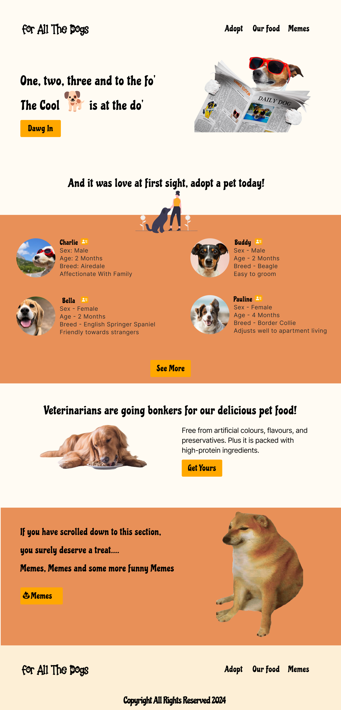
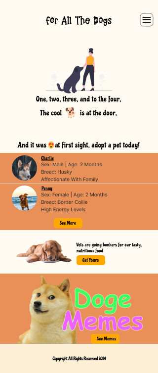

# ForAllTheDogs
Full Stack App built with React 18, Bootstrap 5, ASP .NET Core 6 API, and MS SQL Server 2022. The web app showcases dogs (pets in general) for adoption, dog and cat food and of course dog and cat MEMES.

# Homepage Figma Prototype
# Branding Kit Details
Background Color - #FFFBF3
Primary Color - #FFA800
Secondary Color - #E89058
Footer Color - #FDEFD6

Fonts
-----------
Logo Text - Paw Wow Font
Heading Text - Chicle
Body Text - Inter

# Desktop Version

# Mobile Version

